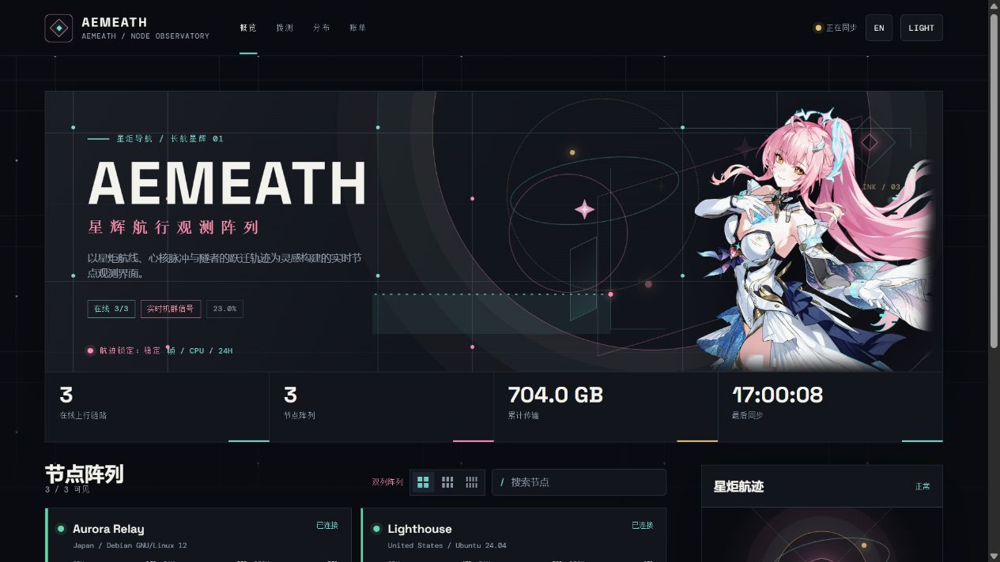

# 爱弥斯 / Aemeath

> 面向 [Komari Monitor](https://github.com/komari-monitor/komari) 的 Vue 3 主题。以《鸣潮》爱弥斯的星炬、长航星辉、绯色心核和跃迁航迹为视觉线索，构建一个以实时节点状态为中心的观测界面。

项目地址：[github.com/adminsama/Aemeath](https://github.com/adminsama/Aemeath)



## 特性

- **真实数据优先**：读取 Komari 的公开节点、实时客户端、历史负载、Ping 记录和拨测任务；缺失字段显示为“未上报”，不伪造监控数据。
- **完整观测路径**：概览、节点详情、拨测、分布地图与账单页面均可直接进入；没有公开价格的节点时，账单入口自动隐藏。
- **可读的状态说明**：首屏连接状态直接呈现在线数和待检查节点数，例如 `32 / 33 在线，1 台待检查`。
- **可缩放图表**：首页信号、拨测延迟、节点负载、节点延迟轨迹均支持悬浮精确值、以指针位置为中心的滚轮缩放，以及双击复位。选中拨测节点后，详情图表会自动置顶并平滑聚焦。
- **3D 分布地球**：基于本地 Three.js 与 50m 世界数据渲染真实球体、高精度国家边界、经纬网、地理标签、航线与节点信标；首次进入会朝向本站节点的球面中心。节点图标与名称使用固定像素覆盖层，缩放地球时不会同步变大；同坐标节点按屏幕像素展开，保留原始经纬度精度。
- **主题载入动效**：首次数据同步、地球边界校准与拨测详情加载统一使用星炬双轨、绯色心核与信号扫描动画；在系统减少动态效果时自动停用长动画。
- **节点详情**：支持展示 CPU 型号、核心/线程、架构、操作系统、内核、内存、磁盘、网络接口、公网地址和 24/48 小时记录。
- **优雅切换**：双列、三列、四列阵列通过 FLIP 重排动画过渡，保留节点卡片身份和当前数据，不会闪烁重建。
- **多端布局**：桌面、平板和手机均有独立响应式布局。手机导航通过 Vue Teleport 固定在视口底部，不参与顶部栏排版；星野模式带有随机闪烁星光与间歇流星。
- **可配置主题**：中英文、明暗外观、人物图片、站点名称、背景模式、节点排序、默认网格、首屏文案与信号指标均可在 Komari 后台配置。
- **独立主题包**：不依赖 Docker，不包含安装脚本、Shell 文件或服务端可执行程序，仅由主题清单、前端静态资源、运行时、预览图与本地视觉资源组成。

## 主题设置

| 配置项 | 用途 |
| --- | --- |
| `character_image` | 人物图片，可用包内默认图片或允许跨域展示的 HTTPS 图片直链。 |
| `panel_subtitle` | 顶栏站点副标题。 |
| `hero_text_zh` / `hero_text_en` | 首屏中文 / 英文说明文案。默认文案为“但愿我会让你感到骄傲，但愿我没有让你失望。”及其英文译文。 |
| `background_mode` | `starfield` 为默认的随机星光与间歇流星背景，`circuit` 为电路板背景。 |
| `show_site_name` | 是否在顶栏显示站点名称。 |
| `node_sort_mode` | `weight_desc`、`weight_asc` 或 `backend`，分别代表权重降序、权重升序和接口原序。 |
| `node_display_mode` | `classic`、`grid_3`、`grid_4`，分别为双列、三列、四列默认网格。访客仍可临时切换。 |
| `hero_signal_metric` | 首屏曲线指标：`cpu`、`ram` 或 `traffic`。 |
| `hero_signal_hours` | 首屏历史窗口，支持 1 至 48 小时。 |
| `hero_signal_nodes` | 首屏曲线参与节点；留空时聚合全部可用节点。 |
| `probe_history_hours` | 拨测综合轨迹的默认时间窗口。 |
| `probe_display_nodes` | 拨测综合轨迹参与节点；留空时采用公开任务全部节点。 |
| `announcement` | 顶部公告文本；留空则不展示。 |
| `cpu_alert` / `memory_alert` / `disk_alert` | 资源告警阈值。 |

## 数据行为

主题使用 Komari 当前公开数据接口：节点配置、实时客户端连接、负载记录、Ping 记录和公开拨测任务。实时连接通过 WebSocket 更新；历史图表仅缩放已经获取到的样本，不补造采样点。地图优先读取节点的 `latitude` / `longitude`、`lat` / `lng` 或 `geo` 经纬度字段，再回退至城市和地区匹配。

账单根据节点公开的 `price`、`currency` 和 `billing_cycle` 折算为 30 天月度估算。不同币种会分组展示，不会把 USD、EUR 等币种直接相加。当没有任何正价格节点时，账单导航和账单页面都会隐藏。

## 项目结构

```text
komari-theme.json                 # 主题清单与后台配置项
preview.png                       # 后台主题预览
dist/
  index.html                      # Vue 应用入口
  assets/
    aemeath-v1.9.0.css            # 版本化样式资源
    aemeath-v1.9.0.js             # 版本化应用逻辑
    aemeath.png                   # 包内默认人物图
    countries-50m.json            # 高精度世界边界数据
  vendor/
    vue.global.prod.js            # Vue 3 运行时
    three.min.js                  # 3D 地球渲染运行时
    topojson-client.min.js        # 世界边界数据解析
```

`index.html` 只引用版本化的静态 CSS/JS 文件，方便 CDN 长缓存，并可在主题升级时通过更新文件名绕过旧缓存。

## 兼容性

- 推荐使用当前版本的 Komari Monitor。
- 支持现代 Chromium、Firefox 和 Safari 浏览器。
- 最小页面宽度为 320px；手机端保留滚动能力但隐藏浏览器滚动条。
- 若实例的公开接口版本缺少部分硬件或历史字段，相关位置会显示“未上报”或空状态，不会影响其余页面。

## 参考

主题在能力设计和数据展示方式上参考了 [komari-nano-muse](https://github.com/saladinxp/komari-nano-muse)、[komari-theme-ink](https://github.com/jacob-bytes/komari-theme-ink) 与 [komari-theme-blueprint](https://github.com/jacob-bytes/komari-theme-blueprint)。界面、交互、布局和代码均为独立实现，未复制上述项目的内容。

## 作者

Ronana / 夜灭
